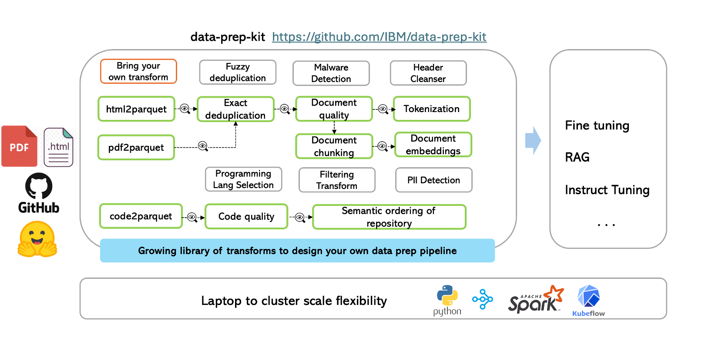

<h1 align="center">Data Prep Kit</h1>

<div align="center"> 

<?  []() ?>
<?  [](https://github.com/IBM/data-prep-kit/issues) ?>
<?  [](https://github.com/IBM/data-prep-kit/pulls) ?>
</div> 

Data Prep Kit is a community project to democratize and accelerate unstructured data preparation for LLM app developers. 
With the explosive growth of LLM-enabled use cases, developers are faced with the enormous challenge of preparing use case-specific unstructured data to fine-tune, instruct-tune the LLMs or to build RAG applications for LLMs.
As the variety of use cases grow, so does the need to support:

- New ways of transforming the data to enhance the performance of the resulting LLMs for each specific use case.
- A large variety in the scale of data to be processed, from laptop-scale to datacenter-scale
- Support for different data modalities including language, code, vision, multimodal etc

Data Prep Kit offers implementations of commonly needed data preparation steps, called *modules* or *transforms*, for both Code and Language modalities, with vision to extend to images, speech and multimodal data. 
The goal is to offer high-level APIs for developers to quickly get started in working with their data, without needing expertise in the underlying runtimes and frameworks.




## 📝 Table of Contents

- [About](#about)
- [Getting Started](#gettingstarted)
- [Scaling transforms from laptop to cluster](#laptop_cluster)
- [Repository Use and Navigation](doc/repo.md)
- [How to Contribute](CONTRIBUTING.md)
- [Resources (papers, talks, presentations and tutorials)](resources.md)
- [Citations](#citations)

## &#x1F4D6; About <a name = "about"></a>

Data Prep Kit is a toolkit for streamlining data preparation for developers looking to build LLM-enabled applications via fine-tuning, RAG or instruction-tuning.
Data Prep Kit contributes a set of modules that the developer can get started with to easily build data pipelines suitable for their use case.
These modules have been tested while producing pre-training datasets for the [Granite open source LLM models](https://huggingface.co/ibm-granite).

The modules are built on common frameworks (for Spark and Ray), called the *data processing library* that allows the developers to build new custom modules that readily scale across a variety of runtimes.

Features of the toolkit: 

- It aims to accelerate unstructured data prep for the "long tail" of LLM use cases.
- It offers a growing set of [module](transforms) implementations across multiple runtimes, targeting laptop-scale to datacenter-scale processing.
- It provides a growing set of [sample data processing pipelines](examples) that can be used for real enterprise use cases.
- It provides the [Data processing library](data-processing-lib/ray) to enable contribution of new custom modules targeting new use cases.
- It uses [Kubeflow Pipelines](https://www.kubeflow.org/docs/components/pipelines/v1/introduction/)-based [workflow automation](kfp/doc/simple_transform_pipeline.md).

Data modalities supported _today_: Code and Natural Language.

## &#x1F680; Getting Started <a name = "gettingstarted"></a>

### Fastest way to experience Data Prep Kit

With no setup necessary, let's use a Google Colab friendly notebook to try Data Prep Kit. This is a simple transform to extract content from PDF files: [examples/notebooks/Run_your_first_transform_colab.ipynb](examples/notebooks/Run_your_first_transform_colab.ipynb)  | [](https://colab.research.google.com/github/IBM/data-prep-kit/blob/dev/examples/notebooks/Run_your_first_transform_colab.ipynb). ([Here](doc/google-colab.md) are some tips for running Data Prep Kit transforms on Google Colab. For this simple example, these tips are either already taken care of, or are not needed.)

### Create a Virtual Environment

To run on a local machine, follow these steps to quickly set up and deploy the Data Prep Kit in your virtual Python environment.

```bash
conda create -n data-prep-kit -y python=3.11
conda activate data-prep-kit
python --version
```

Check if the python version is 3.11. 

If you are using a linux system, install gcc using the below commands:

```bash
conda install gcc_linux-64
conda install gxx_linux-64
```

Next, install the data prep toolkit library. This library installs both the python and ray versions of the transforms. For better management of dependencies, it is recommended to install the same tagged version of both the library and the transform. 

```bash
pip3 install  'data-prep-toolkit[ray]==0.2.2.dev1'
pip3 install  'data-prep-toolkit-transforms[ray,all]==0.2.2.dev1'
pip3 install jupyterlab   ipykernel  ipywidgets

## install custom kernel
python -m ipykernel install --user --name=data-prep-kit --display-name "dataprepkit"
```

Test, your installation. If you are able to import these data-prep-kit libraries successfully in python, your installation has succeeded. 

```bash
## start python interpreter
$   python

# import DPK libraries
>>> from data_processing_ray.runtime.ray import RayTransformLauncher
>>> from data_processing.runtime.pure_python import PythonTransformLauncher
```

If there are no errors, you are good to go!

### Run your first transform locally

Let's try the same simple transform to extract content from PDF files on a local machine. 

**Local Notebook versions**

You can try either one or both of the following two versions: 

- Option 1: Pure python notebook: [examples/notebooks/Run_your_first_transform_python.ipynb](examples/notebooks/Run_your_first_transform_python.ipynb) - easiest to get started
- Option 2: Ray version: This one uses Ray framework for parallel execution while still allowing local processing - [examples/notebooks/Run_your_first_transform_ray.ipynb](examples/notebooks/Run_your_first_transform_ray.ipynb)


To run the notebooks, launch jupyter from the same virtual environment you created using the command below. 

`jupyter lab`

After opening the jupyter notebook, change the kernel to `dataprepkit`, so all libraries will be properly loaded.

Explore more examples [here](examples/notebooks).

### Run your first data prep pipeline

Now that you have run a single transform, the next step is to explore how to put these transforms together to run a data prep pipeline for an end to end use case like fine tuning model or building a RAG application. This [notebook](examples/notebooks/fine%20tuning/code/sample-notebook.ipynb) gives an example of how to build an end to end data prep pipeline for fine tuning for code LLMs. You can also explore how to build a RAG pipeline [here](examples/notebooks/rag).

### Current list of transforms 
The matrix below shows the the combination of modules and supported runtimes. All the modules can be accessed [here](transforms) and can be combined to form data processing pipelines, as shown in the [examples](examples) folder. 


| Modules                                                                              |    Python-only     |        Ray         |       Spark        |     KFP on Ray     |
|:-------------------------------------------------------------------------------------|:------------------:|:------------------:|:------------------:|:------------------:|
| **Data Ingestion**                                                                   |                    |                    |                    |                    |
| [Code (from zip) to Parquet](transforms/code/code2parquet/python/README.md)          | :white_check_mark: | :white_check_mark: |                    | :white_check_mark: |
| [PDF to Parquet](transforms/language/pdf2parquet/python/README.md)                   | :white_check_mark: | :white_check_mark: |                    | :white_check_mark: |
| [HTML to Parquet](transforms/language/html2parquet/python/README.md)                 | :white_check_mark: | :white_check_mark: |                    |                    |
| **Universal (Code & Language)**                                                      |                    |                    |                    |                    | 
| [Exact dedup filter](transforms/universal/ededup/ray/README.md)                      | :white_check_mark: | :white_check_mark: |                    | :white_check_mark: |
| [Fuzzy dedup filter](transforms/universal/fdedup/ray/README.md)                      |                    | :white_check_mark: |                    | :white_check_mark: |
| [Unique ID annotation](transforms/universal/doc_id/ray/README.md)                    | :white_check_mark: | :white_check_mark: | :white_check_mark: | :white_check_mark: |
| [Filter on annotations](transforms/universal/filter/python/README.md)                | :white_check_mark: | :white_check_mark: | :white_check_mark: | :white_check_mark: |
| [Profiler](transforms/universal/profiler/ray/README.md)                              | :white_check_mark: | :white_check_mark: | :white_check_mark: | :white_check_mark: |
| [Resize](transforms/universal/resize/python/README.md)                               | :white_check_mark: | :white_check_mark: | :white_check_mark: | :white_check_mark: |
| [HAP](transforms/universal/hap/python/README.md)                                     | :white_check_mark: | :white_check_mark: |                    | :white_check_mark: |
| [Tokenizer](transforms/universal/tokenization/python/README.md)                      | :white_check_mark: | :white_check_mark: |                    | :white_check_mark: |
| **Language-only**                                                                    |                    |                    |                    |                    |
| [Language identification](transforms/language/lang_id/python/README.md)              | :white_check_mark: | :white_check_mark: |                    | :white_check_mark: |
| [Document quality](transforms/language/doc_quality/python/README.md)                 | :white_check_mark: | :white_check_mark: |                    | :white_check_mark: |
| [Document chunking for RAG](transforms/language/doc_chunk/python/README.md)          | :white_check_mark: | :white_check_mark: |                    | :white_check_mark: |
| [Text encoder](transforms/language/text_encoder/python/README.md)                    | :white_check_mark: | :white_check_mark: |                    | :white_check_mark: |
| [PII Annotator/Redactor](transforms/language/pii_redactor/python/README.md)          | :white_check_mark: | :white_check_mark: |                    | :white_check_mark: |
| **Code-only**                                                                        |                    |                    |                    |                    |
| [Programming language annotation](transforms/code/proglang_select/python/README.md)  | :white_check_mark: | :white_check_mark: |                    | :white_check_mark: |
| [Code quality annotation](transforms/code/code_quality/python/README.md)             | :white_check_mark: | :white_check_mark: |                    | :white_check_mark: |
| [Malware annotation](transforms/code/malware/python/README.md)                       | :white_check_mark: | :white_check_mark: |                    | :white_check_mark: |
| [Header cleanser](transforms/code/header_cleanser/python/README.md)                  | :white_check_mark: | :white_check_mark: |                    | :white_check_mark: |
| [Semantic file ordering](transforms/code/repo_level_ordering/ray/README.md)          |                    | :white_check_mark: |                    |                    |
| [License Select Annotation](transforms/code/license_select/python/README.md)         | :white_check_mark: | :white_check_mark: |                    | :white_check_mark: |


Contributors are welcome to add new modules to expand to other data modalities as well as add runtime support for existing modules!

### Add your own transform

At the core of the framework, is a data processing library, that provides a systematic way to implement the data processing modules. The library is python-based and enables the application of "transforms" to a one or more input data files to produce one or more output data files. We use the popular [parquet](https://arrow.apache.org/docs/python/parquet.html) format to store the data (code or language). 
Every parquet file follows a set [schema](transforms/code/code2parquet/python/README.md). A user can use one or more transforms (or modules) as discussed above to process their data. 
A transform can follow one of the two patterns: annotator or filter.

- **Annotator** An annotator transform adds information during the processing by adding one more columns to the parquet files.
The annotator design also allows a user to verify the results of the processing before the actual filtering of the data.

- **Filter** A filter transform processes the data and outputs the transformed data, e.g., exact deduplication.
A general purpose [SQL-based filter transform](transforms/universal/filter) enables a powerful mechanism for identifying columns and rows of interest for downstream processing.

For a new module to be added, a user can pick the right design based on the processing to be applied. More details [here](transforms).

One can leverage Python-based processing logic and the Data Processing Library to easily build and contribute new transforms. We have provided an [example transform](transforms/universal/noop) that can serve as a template to add new simple transforms. Follow the step by step [tutorial](data-processing-lib/doc/simplest-transform-tutorial.md) to help you add your own new transform. 

For a deeper understanding of the library's architecture, its transforms, and available runtimes, we encourage the reader to consult the comprehensive [overview document](data-processing-lib/doc/overview.md) alongside dedicated sections on [transforms](data-processing-lib/doc/transforms.md) and [runtimes](data-processing-lib/doc/transform-runtimes.md).

Additionally, check out our [video tutorial](https://www.youtube.com/watch?v=0WUMG6HIgMg) for a visual, example-driven guide on adding custom modules.


## 💻 -> 🖥️☁️ From laptop to cluster <a name = "laptop_cluster"></a>
Data-prep-kit provides the flexibility to transition your projects from proof-of-concept (PoC) stage to full-scale production mode, offering all the necessary tools to run your data transformations at high volume. In this section, we enable you how to run your transforms at scale and how to automate them. 

### Scaling of Transforms

To enable processing of large data volumes leveraging multi-mode clusters, [Ray](https://docs.ray.io/en/latest/index.html) 
or [Spark](https://spark.apache.org) wrappers are provided, to readily scale out the Python implementations.

A generalized workflow is shown [here](doc/data-processing.md).

### Automation

The toolkit also supports transform execution automation based on 
[Kubeflow pipelines](https://www.kubeflow.org/docs/components/pipelines/v1/introduction/) (KFP),
tested on a locally deployed [Kind cluster](https://kind.sigs.k8s.io/) and external OpenShift clusters. There is an 
automation to create a Kind cluster and deploy all required components on it.
The KFP implementation is based on the [KubeRay Operator](https://docs.ray.io/en/master/cluster/kubernetes/getting-started.html)
for creating and managing the Ray cluster and [KubeRay API server](https://github.com/ray-project/kuberay/tree/master/apiserver)
to interact with the KubeRay operator. An additional [framework](kfp/kfp_support_lib) along with several
[kfp components](kfp/kfp_ray_components) is used to simplify the pipeline implementation.

A simple transform pipeline [tutorial](kfp/doc/simple_transform_pipeline.md) explains the pipeline creation and execution. 
In addition, if you want to combine several transformers in a single pipeline, you can look at [multi-steps pipeline](kfp/doc/multi_transform_pipeline.md) 

When you finish working with the cluster, and want to clean up or destroy it. See the 
[clean up the cluster](kfp/doc/setup.md#cleanup)

### Run your first transform using command line options

You can run transforms via docker image or using virtual environments. This [document](doc/quick-start/run-transform-venv.md) shows how to run a transform using virtual environment. You can follow this [document](doc/quick-start/run-transform-image.md) to run using docker image. 


## Citations <a name = "citations"></a>

If you use Data Prep Kit in your research, please cite our paper:

```bash
@misc{wood2024dataprepkitgettingdataready,
      title={Data-Prep-Kit: getting your data ready for LLM application development}, 
      author={David Wood and Boris Lublinsky and Alexy Roytman and Shivdeep Singh 
      and Abdulhamid Adebayo and Revital Eres and Mohammad Nassar and Hima Patel 
      and Yousaf Shah and Constantin Adam and Petros Zerfos and Nirmit Desai 
      and Daiki Tsuzuku and Takuya Goto and Michele Dolfi and Saptha Surendran 
      and Paramesvaran Selvam and Sungeun An and Yuan Chi Chang and Dhiraj Joshi 
      and Hajar Emami-Gohari and Xuan-Hong Dang and Yan Koyfman and Shahrokh Daijavad},
      year={2024},
      eprint={2409.18164},
      archivePrefix={arXiv},
      primaryClass={cs.AI},
      url={https://arxiv.org/abs/2409.18164}, 
}
```
