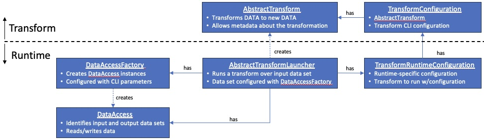

# Data Processing Overview 
The Data Processing Framework is python-based and enables the 
application of "transforms" to  a one or more input data files 
to produce one or more output data files.
Various [runtimes](transform-runtimes.md) are available to execute
the transforms using a common shared methodology and mechanism
to configure input and output across either local or S3-base storage.

The framework allows simple 1:1 transformation of (parquet) files, but also enables
more complex transformations requiring coordination among transforming nodes.
This might include operations such as de-duplication, merging, and splitting.
The framework uses a plug-in model for the primary functions.  The core
transformation-specific classes/interfaces are as follows:

* [AbstractTransform](../python/src/data_processing/transform/abstract_transform.py) - 
a simple, easily-implemented interface allowing the definition transforms
over arbitrary data types.  Support is provided for both
[files](../python/src/data_processing/transform/binary_transform.py) of arbitrary data as a byte array and 
[parquet/arrow](../python/src/data_processing/transform/table_transform.py) tables.
* [TransformConfiguration](../python/src/data_processing/transform/transform_configuration.py) - defines
the transform short name, its implementation class,  and command line configuration
parameters.

In support of running a transform over a set of input data in a runtime, the
following class/interfaces are provided:

* [AbstractTransformLauncher](../python/src/data_processing/runtime/transform_launcher.py) - is the central
runtime interfacee expected to be implemented by each runtime ([python](python-runtime.md)
  [ray](ray-runtime.md), [spark](spark-runtime.md), etc.) to apply a transform to a set of data.
  It is configured with a `TransformRuntimeConfiguration` and a `DataAccessFactory` instance (see below).
* [DataAccessFactory](../python/src/data_processing/data_access/data_access_factory_base.py) - is
used to configure the input and output data files to be processed and creates
the `DataAccess` instance (see below) according to the CLI parameters.
* [TransformRuntimeConfiguration](../python/src/data_processing/runtime/runtime_configuration.py) - captures
  the `TransformConfiguration` and runtime-specific configuration.
* [DataAccess](../python/src/data_processing/data_access/data_access.py) - is
  the interface defining data i/o methods and selection.  Implementations for local
  and S3 storage are provided.

To learn more consider the following:

* [Transforms](transforms.md)
* [Transform Exceptions](transform-exceptions.md)
* [Transform Runtimes](transform-runtimes.md)
* [Transform Examples](transform-tutorial-examples.md)
* [Simplified transform APIs](simplified_transform_apis.md)
* [Data Access Factory](data-access-factory.md)
* [Testing Transforms](transform-testing.md)
* [Utilities](transformer-utilities.md)
* [Architecture Deep Dive](architecture.md)
* [Transform project root readme](../../transforms/README.md)

