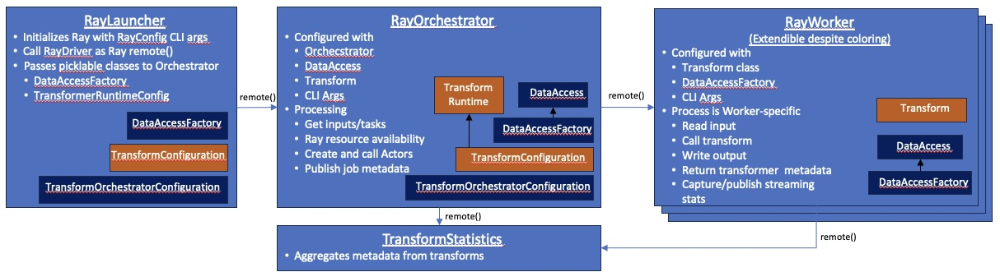

# Transform Tutorials

All transforms operate on a [pyarrow Table](https://arrow.apache.org/docs/python/generated/pyarrow.Table.html)
and produce zero or more transformed tables and transform specific metadata.
The Transform itself need only be concerned with the conversion of one in memory table at a time.  

When running in the Ray worker (i.e. [TransformTableProcessor](../src/data_processing/ray/transform_table_processor.py) ), the input
tables are read from parquet files and the transform table(s) is/are stored in destination parquet files.
Metadata accumulated across calls to all transforms is stored in the destination.

### Transform Basics
In support of this model the class 
[AbstractTableTransform](../src/data_processing/transform/table_transform.py) 
is expected to be extended when implementing a transform.
The following methods are defined:

* ```__init__(self, config:dict)``` - an initializer through which the transform can be created 
with implementation-specific configuration.  For example, the location of a model, maximum number of
rows in a table, column(s) to use, etc. 
* ```transform(self, table:pyarrow.Table) -> tuple(list[pyarrow.Table], dict)``` - this method is responsible
for the actual transformation of a given table to zero or more output tables, and optional 
metadata regarding the transformation applied.  Zero tables might be returned when
merging tables across calls to `transform()` and more than 1 table might be returned
when splitting tables by size or other criteria.
  * _output tables list_ - the RayWork handles the various number of returned tables as follows: 
    * 0 - no file will be written out and the input file name will not be used in the output directory.
    * 1 - one parquet file will be written to the output directory with 
    * N - N parquet files are written to the output with `_<index>` appended to the base file name
  * _dict_ - is a dictionary of transform-specific data keyed to numeric values.  The RayWorker will
         accumulate/add dictionaries across all calls to transform across all RayWorkers.  As an example, a
         transform might wish to track the number of instances of PII entities detected and might return 
        this as `{ "entities" : 1234 }`.
* ```flush() -> tuple(list[pyarrow.Table], dict)``` - this is provided for transforms that
make use of buffering (e.g. [coalesce](../../transforms/universal/coalesce/src/coalesce_transform.py)) across calls 
to `transform()` and need to be flushed of all buffered data at the end of processing of input tables.  
The return values are handled the same waa as the return values for `transform()`.  Since most transforms will likely
not need this feature, a default implementation is provided to return an empty list and empty dictionary.

### Running in Ray
When a transform is run using the Ray-based framework a number of other capabilities are involved:

* [Transform Runtime](../src/data_processing/ray/transform_runtime.py) - this provides the ability for the
transform implementor to create additional Ray resources 
and include them in the configuration used to create a transform
(see, for example, [exact dedup](../../transforms/universal/ededup/src/ededup_transform.py) 
or [blocklist](../../transforms/universal/blocklisting/src/blocklist_transform.py)).
This also provide the ability to supplement the statics collected by
[Statistics](../src/data_processing/ray/transform_statistics.py) (see below).
* [Transform Configuration](../src/data_processing/ray/transform_runtime.py) - defines the following:
  * the transform class to be used, 
  * command line arguments used to initialize the Transform Runtime and generally, the Transform.
  * Transform Runtime class to use
  * transform short name 
* [Transform Launcher](../src/data_processing/ray/transform_launcher.py) - this is a class generally used to 
implement `main()` that makes use of a Transform Configuration to start the Ray runtime and execute the transforms.

Roughly speaking the following steps are completed to establish transforms in the RayWorkers

1. Launcher parses the CLI parameters using an ArgumentParser configured with its own CLI parameters 
along with those of the Transform Configuration, 
2. Launcher passes the Transform Configuration and CLI parameters to the [RayOrchestrator](../src/data_processing/ray/transform_orchestrator.py)
3. RayOrchestrator creates the Transform Runtime using the Transform Configuration and its CLI parameter values
4. Transform Runtime creates transform initialization/configuration including the CLI parameters,  
and any Ray components need by the transform.
5. [RayWorker](../src/data_processing/ray/transform_table_processor.py) is started with configuration from the Transform Runtime.
6. RayWorker creates the Transform using the configuration provided by the Transform Runtime.
7. Statistics is used to collect the statistics submitted by the individual transform, that 
is used for building execution metadata.



#### Transform Launcher
The [TransformLauncher](../src/data_processing/ray/transform_launcher.py) uses the Transform Configuration
and provides a single method, `launch()`, that kicks off the Ray environment and transform execution coordinated 
by [orchestrator](../src/data_processing/ray/transform_orchestrator.py).
For example,
```python
launcher = TransformLauncher(MyTransformConfiguration())
launcher.launch()
```
Note that the launcher defines some additional CLI parameters that are used to control the operation of the 
[orchestrator and workers](../src/data_processing/ray/transform_orchestrator_configuration.py) and 
[data access](../src/data_processing/data_access/data_access_factory.py).  Things such as data access configuration,
number of workers, worker resources, etc.
Discussion of these options is beyond the scope of this document 
(see [Launcher Options](launcher-options.md) for a list of available options.)

#### Transform Configuration
The 
[DefaultTableTransformConfiguration](../src/data_processing/ray/transform_runtime.py)
class is sub-classed and initialized with transform-specific name, and implementation 
and runtime classes. In addition, it is responsible for providing transform-specific
methods to define and filter optional command line arguments.
Finally, it creates the Transform Runtime, for which a default
implementation uses the class available in the Transform Configuration.
```python

class MyTransformConfiguration(DefaultTableTransformConfiguration):

    def __init__(self):
        super().__init__(name="MyTransform", transform_class=MyTransform,
                          runtime_class=MyTransformRuntime
        self.params = {}
    def add_input_params(self, parser: ArgumentParser) -> None:
        ...
    def apply_input_params(self, args: Namespace) -> bool:
        ...
    def create_transform_runtime(self) -> DefaultTableTransformRuntime:
        ...
```
Details are covered in the samples below.

#### Transform Runtime
The 
[DefaultTableTransformRuntime](../src/data_processing/ray/transform_runtime.py)
class is provided and will be 
sufficient for many use cases, especially 1:1 table transformation.
However, some transforms will require use of the Ray environment, for example,
to create additional workers, establish a shared memory object, etc.
Of course, these transforms will generally not run outside of Ray environment. 

```python
class DefaultTableTransformRuntime:

    def __init__(self, params: dict[str, Any]):
        ...

    def get_transform_config(
        self, data_access_factory: DataAccessFactory, statistics: ActorHandle, files: list[str]
    ) -> dict[str, Any]:
        ...

    def compute_execution_stats(self, stats: dict[str, Any]) -> dict[str, Any]:
        ...
```

The RayOrchestrator initializes the instance with the CLI parameters provided by the Transform Configurations
`get_input_params()` method.

The `get_transform_config()` method is used by the RayOrchestrator to create the parameters
used to initialize the Transform in the RayWorker. 
This is where additional Ray components would be added to the environment 
and references added to them, as needed, in the returned dictionary of configuration data
that will initialize the transform.
For those transforms that don't need this support, the default implementation
simpy returns the CLI parameters used to initialize the runtime instance.

The `computed_execution_stats()` provides an opportunity to augment the statistics
collected and aggregated by the TransformStatistics actor. It is called by the RayOrchestrator
after all files have been processed.

### Exceptions
A transform may find that it needs to signal error conditions.
For example, if a referenced model could not be loaded or
a given table does not have the expected column.
In general, it should identify such conditions by raising an exception. 
With this in mind, there are two types of exceptions:

1. Those that would not allow any tables to be processed (e.g. model loading problem).
2. Those that would not allow a specific table to be processed (e.g. missing column).

In the first situation the transform should throw an exception from the initializer, which
will cause the Ray framework to terminate processing of all tables. 
In the second situation (identified in the `transform()` or `flush()` methods), the transform
should throw an exception from the associated method.  This will cause only the
error-causing
table to be ignored and not written out, but allow continued processing of tables by 
the transform.
In both cases, the framework will log the exception as an error.


### Tutorial Examples
With these basic concepts in mind, we start with a simple example and 
progress to more complex transforms. 
Before getting started  you may want to consult the 
[transform project root readme](../../transforms/README.md) documentation.

* [Simplest transform](simplest-transform-tutorial.md) - 
Here we will take a simple example to show the basics of creating a simple transform
that takes a single input Table, and produces a single Table.
* [External resources transform](transform-external-resources.md) - shows how to load additional
resources (models, configuration, etc) for a transform.
* [Advanced transform](advanced-transform-tutorial.md)

Once a transform has been built, testing can be enabled with the testing framework:

* [Transform Testing](testing-transforms.md) - shows how to test a transform
independent of the Ray framework.
* [End-to-End Testing](testing-e2e-transform.md) - shows how to test the
transform running in the Ray environment.

### Additional transform support

We also strted a library of [transform utilities](transformer-utilities.md)
