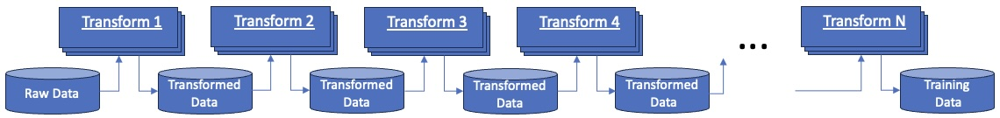

# Data Schema and Processing
The transformation framework is designed to operate on rows of columnar data, generally contained
in [parquet](https://arrow.apache.org/docs/python/parquet.html) files 
and read as [pyarrow tables](https://arrow.apache.org/docs/python/index.html).

Transforms are written to process the [table](https://arrow.apache.org/docs/python/generated/pyarrow.Table.html)
to, for example:

* Annotate the tables to add additional data such as document quality score, language, etc.
* Derive statistics on data in one or more columns 
* Filter the table to remove or edit rows and/or columns, for example to remove rows from blocked domains.

To address scalability, each transform is generally run in a cluster of identical docker images
making use of the Ray services, also deployed into the cluster.  A single run of a transform will convert a set
of parquet files from a source directory into a destination directory containing the transformed parquet files.
In general, multiple transforms are run in sequence to produce a final LLM training data set as depicted below.

 
