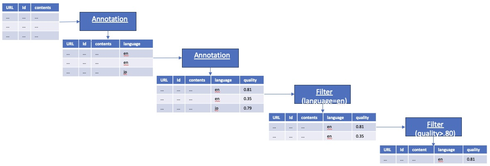

# Data Schema and Processing
The transformation framework is designed to operate on rows of columnar data, generally contained
in [parquet](https://arrow.apache.org/docs/python/parquet.html) files 
and read as [pyarrow tables](https://arrow.apache.org/docs/python/index.html).

Transforms are written to process the [table](https://arrow.apache.org/docs/python/generated/pyarrow.Table.html)
to, for example:

* Annotate the tables to add additional data such as document quality score, language, etc.
* Derive statistics on data in one or more columns 
* Filter the table to remove or edit rows and/or columns, for example to remove rows from blocked domains.

The table is generally expected to have something like the following minimal set of columns :
* URL source of the document (can be use for domain block listing)
* Document id
* Contents of the actual dcoument to be used for LLM training

The following might be an example sequence of transforms.

The ordering of the transforms can change depending on the requirements on the training data. 

To address scalability, each transform is generally run in a cluster of identical docker images
making use of the Ray services, also deployed into the cluster.  A single run of a transform will convert a set
of parquet files from a source directory (think terabytes) into a destination directory containing 
the transformed parquet files.
Multiple transforms are run in sequence on persistently stored data (i.e. parquet files)
to produce a final LLM training data set as depicted below.

Below is another example with the following steps for language:
1. Removes duplicate documents by remove rows from the input tables 
2. Adds a column annotation identifying the document's language
3. Filters documents matchine an chosen language 
4. Scores each document with a quality score
5. Filters documents for a minimum quality score (not shown below)
N. Tokenizes each document, placing tokens in a new column.

The result is a set of documents that are ready for LLM training.

 
