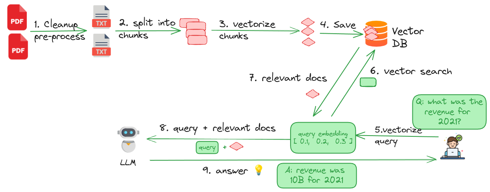

## RAG Process Explained

RAG conists of two phases

- **1 - Import phase**:  Preparing and indexing the data  (the top row in the diagram)
- **2 - Querying phase**: query the data prepared in phase 1  (bottom row in the  diagram)

### Step 1 (Ingest): Cleanup documents

Remove markups, perform de-duplication ..etc

### Step 2 (Ingest): Split into chunks

Split the documents into manageable chunks or segments. There are various chunking stratergies.  Documents can be split into pages or paragraphs or sections.  The right chunking strategy depends on the document types being processed

### Step 3 (Ingest): Vectorize / Calculate Embeddings

In order to make text searchable, we need to 'vectorize' them.  This is done by using **embedding models**.  We will feature a variety of embedding models, open source ones and API based ones.

### Step 4 (Ingest). Saving Data into Vector Database

In order to effectivly retrieve relevant documents, we use [Milvus](https://milvus.io/) - a very popular open source, vector database.

### Step 5 (Query). Vectorize Question 

When user asks a question, we are going to vectorize the question so we can fetch documents that **may** have the answer question.

For example, if a user asks a financial question ('how much was the revenue in 2022') the answer is most likely in financial documents, not in employee handbooks.

So we want to retrieve the relevant documents first.

### Step 6 (Query): Vector Search

We send the 'vectorized query' to vector database to retrieve the relevant documents.

### Step 7 (Query): Retrieve Relevant Documents

Vector database looks at our query (in vectorized form), searches through the documents and returns the documents matching the query.

This is an important step, because it **cuts down the 'search space'**.  For example, if have 1000 pdf documents, and only a small number of documents might contain the answer, it returns the relevant documents.

The search has to be accurate, as these are the documents sent to LLM as **'context'**.  LLM will look through these documents searching for the answer to our question

### Step 8 (Query): Send relevant documents and query LLM

We send the relevant documents (returned in the above step by Vector DB) and our query to LLM.

LLMs can be accessed via API or we can run one locally.

### Step 9 (Query): Answer from LLM

Now we get to see the answer provided by LLM 👏

