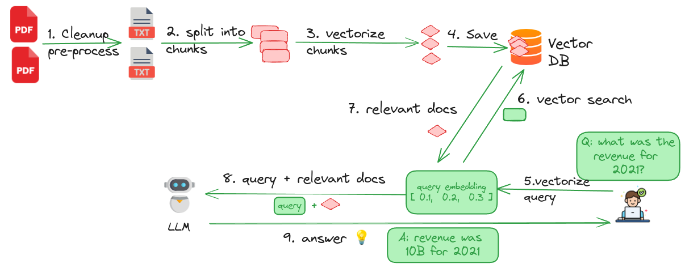

# RAG with Data Prep Kit

This folder has examples of RAG applications with data prep kit (DPK).

## Step-0: Getting Started

```bash
## Clone this repo
git  clone   https://github.com/sujee/data-prep-kit

cd data-prep-kit

## checkout the branch
git checkout rag-example1
```

## Step-1: Setup Python Environment

[setup-python-dev-env.md](./setup-python-dev-env.md)

Once the environment is setup, be sure to activate it


## RAG Workflow

Here is the overall work flow.  For details see [RAG-explained](./RAG-explained.md)



## Step-2: Process Input Documents

This code uses DPK to 

- Extract text from PDFs (RAG stage-1)
- Performs de-dupes (RAG stage-1)
- split the documents into chunks (RAG stage-2)
- vectorize the chunks (RAG stage-3)

Here is the code: 

- Python version: TODO
- Ray version: [rag_1A_process_ray.ipynb](rag_1A_process_ray.ipynb)

Here is how to execute the code

- `make jupyter`  - this will start Jupyter
- Go to Jupyter URL printed on terminal
- And run the notebook: [rag_1A_process_ray.ipynb](rag_1A_process_ray.ipynb)