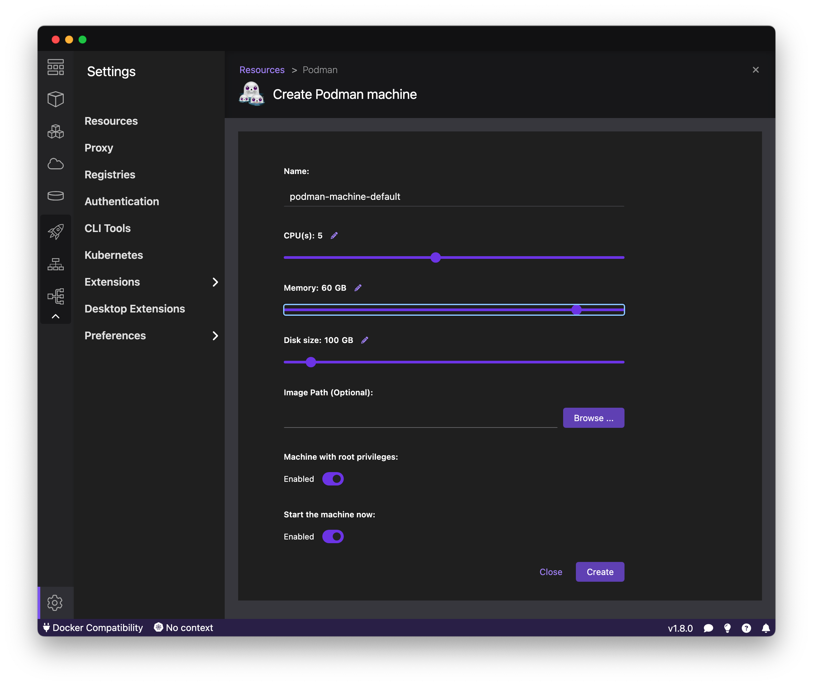

# Development and Testing on macOS

Users can develop and test the system locally. This can be achieved by executing a local [kind](https://kind.sigs.k8s.io/) 
Kubernetes cluster. On Linux or Windows (WSL) operating systems, users can utilize 
[Docker Engine](https://docs.docker.com/engine/). However, Docker on macOS necessitates 
[Docker Desktop](https://www.docker.com/products/docker-desktop/), which for 
commercial usage requires a paid subscription. Alternatively,
[Podman](https://podman.io/) can serve as a free substitute. This document provides instructions for installing and 
configuring Podman.

## Podman Installation
- Download and install Podman from its [website](https://podman.io/). (It can be either Podman Desktop or just Podman CLI)
- Running this project with [KubeFlow pipelines](https://www.kubeflow.org/docs/components/pipelines/v1/introduction/) 
requires more CPU and Memory than what the default Podman virtual machine provides. Therefore, its settings should be 
adjusted.
  - For Podman CLI execute `podman machine init --cpus 5 --memory 61440`
  - For Podman Desktop, open the "Settings" and set required CPUS and Memory.  
- Execute `make setup` from the `scripts/k8s-setup` directory.
  - The installation of Kubeflow pipelines takes time, and some of its pods may experience crashes during startup. 
  Therefore, we kindly ask for your patience and to wait until ALL pods are in the Ready state. 
