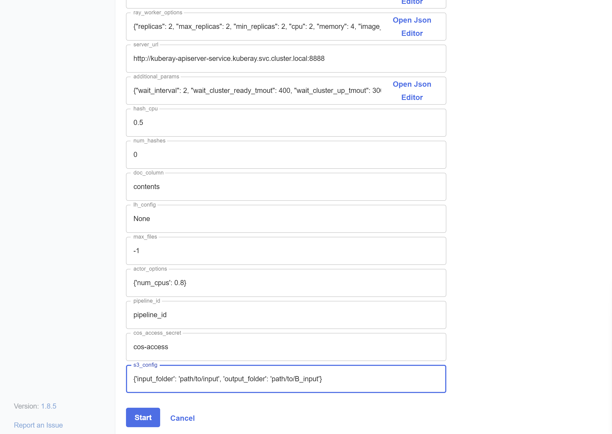
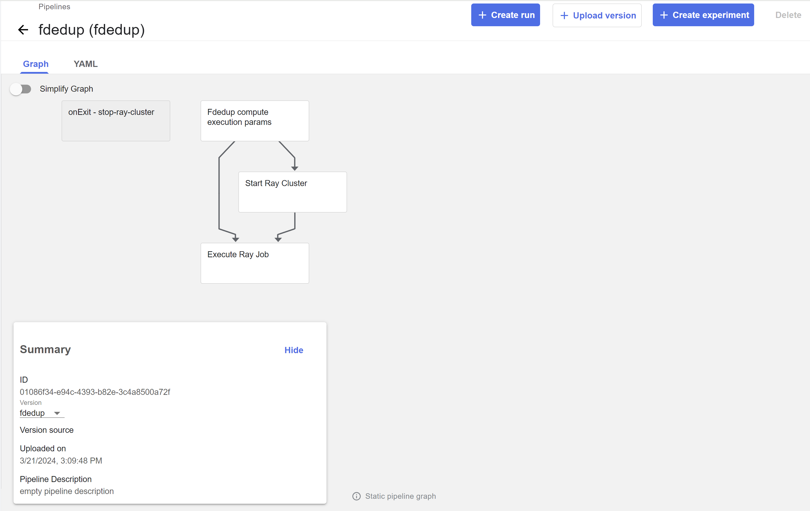
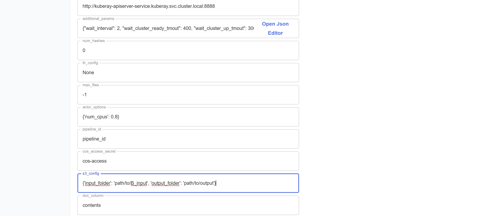
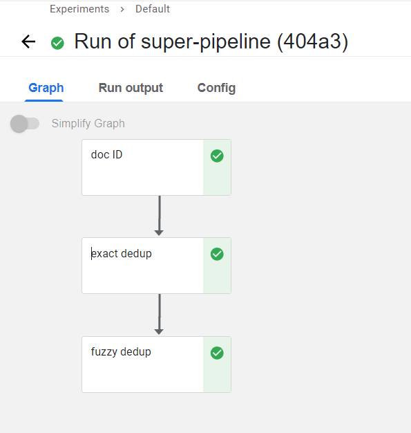

# Run several transforms

In a common scenario, users want to run a pipeline or a series of several transforms one after the other. Here we can show how to execute several transforms.

Let's assume that the input folder path is `path/to/input` and a user wants to save the output of the data after several transforms in `path/to/output`. Let's assume also that the user wants to apply the transform `A` then the transform `B` on his data.

In [Executing pipeline and watching execution results](simple_transform_pipeline.md#executing-pipeline-and-watching-execution-results) you can learn how to run a KFP pipeline of one transform. We want to use the same method to combine several transform pipelines together.

Let's start with transform A (in this example it is exact deduplication). After uploading the pipeline you can create a run from this page:

After clicking `create run` a list of input parameters is shown on the screen. In this document we want to deal with the `data_s3_config` input parameter. This parameter specifies the input folder path and output folder path. For the transform A we should have `input_folder = path/to/input` and the `output_folder=/path/to/<B>_input` which is an intermediate folder that we will use as an input for the next transform.

After completing the first transformation, we can continue to the next one. As in the previous step, we update the pipeline input parameters for the transformer `B` (in this example it is fuzzy deduplication) and create a Run.

In the list of its input parameters, we also see `data_s3_config`. Now, we have `input_folder = path/to/B_input` (the output folder of the previous transformation pipeline) and `output_folder=/path/to/output`, the desired output folder for the whole task. if we want to execute several transformation pipelines, we have to define more intermediate folders.

**Note** An example super pipeline that combines several transforms, `doc_id`, `ededup`, and `fdedup`, can be found in [superworkflow_dedups_sample_wf.py](../transform_workflows/superworkflows/superworkflow_dedups_sample_wf.py).

The input parameters of the super pipelines:

There are several `groups` of input parameters for super pipelines, each group of parameters has a prefix of "p<x>_" string, where <x> is an order number.

"p1_" prefix group of parameters:

- The pipeline names of the tasks that form the super pipeline.

"p2_" group:

- parameters of the ray cluster (head and workers options) that are common to all tasks.

- input/output paths: There are three parameters that specify the input and output paths for all the pipeline steps. The parameters are `p2_pipeline_input_parent_path`, `p2_pipeline_output_parent_path` `p2_pipeline_parent_path_suffix`.

   The input of the first step is `p2_pipeline_input_parent_path` + `/` + `p2_pipeline_parent_path_suffix`.

    The output of step S is: `p2_pipeline_output_parent_path` + `_<task1Name>_…_<taskSName>` + `/` + `p2_pipeline_parent_path_suffix`.

    The output of step S will be the input of the step S+1 (the next step).

- `p2_pipeline_additional_params`: it is a json string that includes a several parameters that passed to all steps of the super pipeline (similar to default values that can be overwritten in each step).

`p3_` to `p<x>_`: 

- Each group of `p<s>_` is a list of parameters of the step `<s>`. It includes a

    - Step name that is used in the output paths.

    - Several parameters that pass to the step pipeline.

    - Skip parameter: if `True` then skip this step.

    - JSON string parameter named `overriding_params` that can be used to modify `p2_` prefixed input pipeline parameters and add additional inputs that are not listed as separate input parameters to the step pipeline.  Note: if there are Boolean parameters it should be specified as a string value of `"True"` or `"False"` (with quotation mark).
