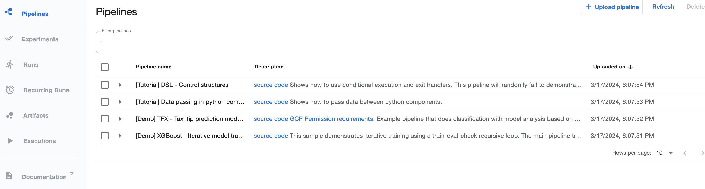
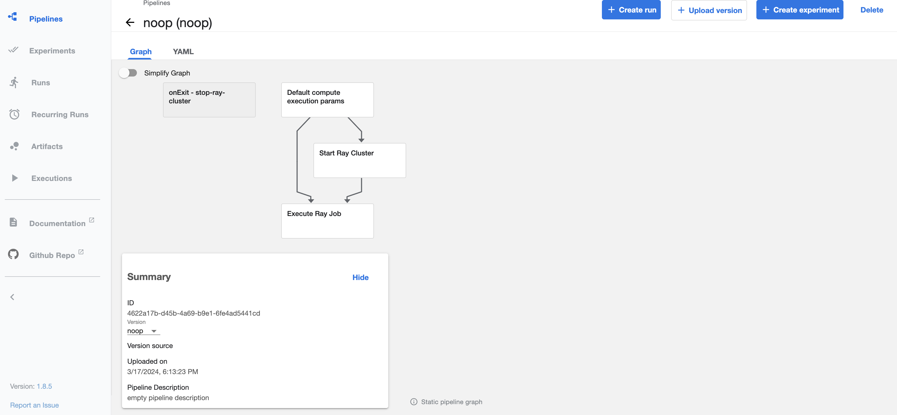
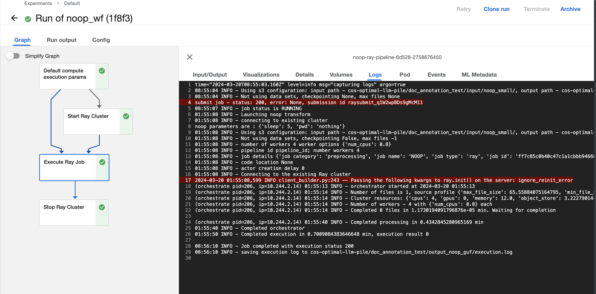

# Simplest Transform pipeline tutorial

In this example, we implement a pipeline to automate execution of the simple 
[noop transform](../../data-processing-lib/doc/simplest-transform-tutorial.md)

In this tutorial, we will show the following:

* How to write the `noop` transform automation pipeline, leveraging [KFP components](../kfp_ray_components/README.md).
* How to compile a pipeline and deploy it to KFP
* How to execute pipeline and view execution results

Note: the project and the explanation below are based on [KFPv1](https://www.kubeflow.org/docs/components/pipelines/v1/)

## Implementing pipeline

[Overall implementation](../transform_workflows/universal/noop/noop_wf.py) roughly contains 5 major sections:

* Imports
* Components definition - definition of the main steps of our pipeline
* Input parameters definition 
* Pipeline wiring - definition of the sequence of invocation (with parameter passing) of participating components
* Additional configuration

### Imports definitions:

```python
import kfp.compiler as compiler
import kfp.components as comp
import kfp.dsl as dsl
from kfp_support.workflow_support.utils import (
    ONE_HOUR_SEC,
    ONE_WEEK_SEC,
    ComponentUtils,
)
from kubernetes import client as k8s_client
```

### Components definition

Our pipeline includes 4 steps - compute execution parameters, create Ray cluster, submit and watch Ray job, clean up 
Ray cluster. For each step we have to define a component that will execute them:

```python
    # components
    base_kfp_image = "quay.io/dataprep1/data-prep-kit/kfp-data-processing:0.0.2"
    # compute execution parameters. Here different tranforms might need different implementations. As
    # a result, instead of creating a component we are creating it in place here.
    compute_exec_params_op = comp.func_to_container_op(
      func=ComponentUtils.default_compute_execution_params, base_image=base_kfp_image
    )
    # create Ray cluster
    create_ray_op = comp.load_component_from_file("../../../kfp_ray_components/createRayComponent.yaml")
    # execute job
    execute_ray_jobs_op = comp.load_component_from_file("../../../kfp_ray_components/executeRayJobComponent.yaml")
    # clean up Ray
    cleanup_ray_op = comp.load_component_from_file("../../../kfp_ray_components/cleanupRayComponent.yaml")
    # Task name is part of the pipeline name, the ray cluster name and the job name in DMF.
    TASK_NAME: str = "noop"
```
Note: here we are using shared components described in this [document](../kfp_ray_components/README.md) for `create_ray_op`, 
`execute_ray_jobs_op` and `cleanup_ray_op`,  while `compute_exec_params_op` component is built inline, because it might
differ significantly. For "simple" pipeline cases we can use the 
[default implementation](../kfp_support_lib/src/kfp_support/workflow_support/utils/workflow_utils.py),
while, for example for exact dedup, we are using a very [specialized one](../transform_workflows/universal/ededup/src/ededup_compute_execution_params.py).

### Input parameters definition

The input parameters section defines all the parameters required for the pipeline execution:

```python
    # Ray cluster
    ray_name: str = "noop-kfp-ray",  # name of Ray cluster
    ray_head_options: str = '{"cpu": 1, "memory": 4, "image_pull_secret": "",\
                 "image": "' + task_image + '" }',
    ray_worker_options: str = '{"replicas": 2, "max_replicas": 2, "min_replicas": 2, "cpu": 2, "memory": 4, "image_pull_secret": "",\
                "image": "' + task_image + '" }',
    server_url: str = "http://kuberay-apiserver-service.kuberay.svc.cluster.local:8888",
    # data access
    data_s3_config: str = "{'input_folder': 'test/noop/input/', 'output_folder': 'test/noop/output/'}",
    data_s3_access_secret: str = "s3-secret",
    data_max_files: int = -1,
    data_num_samples: int = -1,
    # orchestrator
    actor_options: str = "{'num_cpus': 0.8}",
    pipeline_id: str = "pipeline_id",
    code_location: str = "{'github': 'github', 'commit_hash': '12345', 'path': 'path'}",
    # noop parameters
    noop_sleep_sec: int = 10,
    # additional parameters
    additional_params: str = '{"wait_interval": 2, "wait_cluster_ready_tmout": 400, "wait_cluster_up_tmout": 300, "wait_job_ready_tmout": 400, "wait_print_tmout": 30, "http_retries": 5}',
```

The parameters used here are as follows:

* ray_name: name of the Ray cluster
* ray_head_options: head node options, containing the following:
  * cpu - number of cpus
  * memory - memory
  * image - image to use
  * image_pull_secret - image pull secret
* ray_worker_options: worker node options (we here are using only 1 worker pool), containing the following:
  * replicas - number of replicas to create
  * max_replicas - max number of replicas
  * min_replicas - min number of replicas
  * cpu - number of cpus
  * memory - memory
  * image - image to use
  * image_pull_secret - image pull secret
* server_url - server url
* additional_params: additional (support) parameters, containing the following:
  * wait_interval - wait interval for API server, sec
  * wait_cluster_ready_tmout - time to wait for cluster ready, sec
  * wait_cluster_up_tmout - time to wait for cluster up, sec
  * wait_job_ready_tmout - time to wait for job ready, sec
  * wait_print_tmout - time between prints, sec
  * http_retries - http retries for API server calls
* data_s3_access_secret - s3 access secret
* data_s3_config - s3 configuration
* data_max_files - max files to process
* data_num_samples - num samples to process
* actor_options - actor options
* pipeline_id - pipeline id
* code_location - code location
* noop_sleep_sec - noop sleep time

**Note** that here we are specifying initial values for all parameters that will be propagated to the workflow UI
(see below)

**Note** Parameters are defining both S3 and Lakehouse configuration, but only one at a time can be used.

### Pipeline wiring

Now, when all components and input parameters are defined, we can implement pipeline wiring defining sequence of 
component execution and parameters submitted to every component. 

```python
    # create clean_up task
    clean_up_task = cleanup_ray_op(ray_name=ray_name, run_id=dsl.RUN_ID_PLACEHOLDER, server_url=server_url)
    ComponentUtils.add_settings_to_component(clean_up_task, 60)
    # pipeline definition
    with dsl.ExitHandler(clean_up_task):
      # compute execution params
      compute_exec_params = compute_exec_params_op(
        worker_options=ray_worker_options,
        actor_options=actor_options,
      )
      ComponentUtils.add_settings_to_component(compute_exec_params, ONE_HOUR_SEC * 2)
      # start Ray cluster
      ray_cluster = create_ray_op(
        ray_name=ray_name,
        run_id=dsl.RUN_ID_PLACEHOLDER,
        ray_head_options=ray_head_options,
        ray_worker_options=ray_worker_options,
        server_url=server_url,
        additional_params=additional_params,
      )
      ComponentUtils.add_settings_to_component(ray_cluster, ONE_HOUR_SEC * 2)
      ray_cluster.after(compute_exec_params)
      # Execute job
      execute_job = execute_ray_jobs_op(
        ray_name=ray_name,
        run_id=dsl.RUN_ID_PLACEHOLDER,
        additional_params=additional_params,
        # note that the parameters below are specific for NOOP transform
        exec_params={
          "data_s3_config": data_s3_config,
          "data_max_files": data_max_files,
          "data_num_samples": data_num_samples,
          "num_workers": compute_exec_params.output,
          "worker_options": actor_options,
          "pipeline_id": pipeline_id,
          "job_id": dsl.RUN_ID_PLACEHOLDER,
          "code_location": code_location,
          "noop_sleep_sec": noop_sleep_sec,
        },
        exec_script_name=EXEC_SCRIPT_NAME,
        server_url=server_url,
      )
      ComponentUtils.add_settings_to_component(execute_job, ONE_WEEK_SEC)
      ComponentUtils.set_s3_env_vars_to_component(execute_job, data_s3_access_secret)
      execute_job.after(ray_cluster)
```

Here we first create `cleanup_task` and the use it as an 
[exit handler](https://kubeflow-pipelines.readthedocs.io/en/stable/source/dsl.html#kfp.dsl.ExitHandler) which will be 
invoked either the steps into it succeeded or failed.

Then we create each individual component passing it required parameters and specify execution sequence, for example
(`ray_cluster.after(compute_exec_params)`).

### Additional configuration

The final thing that we need to do is set some pipeline global configuration:

```python
    # Configure the pipeline level to one week (in seconds)
    dsl.get_pipeline_conf().set_timeout(ONE_WEEK_SEC)
```

## Compiling pipeline

To compile pipeline execute `make build` command in the same directory where your pipeline is

## Preparing cluster for pipeline execution

The project provides instructions and deployment automation to run all components in an all-inclusive fashion on a 
single machine using a Kind cluster. However, this topology is not suitable for processing medium and large datasets, 
and deployment should be carried out on a real Kubernetes or OpenShift cluster. Therefore, we recommend using Kind 
cluster for only for local testing and debugging, not production loads. For production loads use a real Kubernetes cluster.

### Preparing Kind cluster

You can create a Kind cluster with all required software installed
using the following command: 

````shell
 make setup
````

We tested Kind cluster installation on multiple platforms, including Intel Mac, 
AMD Mac (see [this](deployment_on_MacOS.md)), WSL on Windows, 
RHEL and Ubuntu. Additional platform can be used, but might require additional configuration and testing.

### Preparing an existing Kubernetes cluster
Alternatively you can deploy pipeline to the existing Kubernetes cluster. 

#### Pre-requirements
Deployment on an existing cluster requires less pre-installed software
Only the following programs should be manually installed:

- [Helm](https://helm.sh/docs/intro/install/) 3.10.0 or greater must be installed and configured on your machine.
- [Kubectl](https://kubernetes.io/docs/tasks/tools/#kubectl) 1.26 or newer must be installed on your machine, and be 
able to connect to the external cluster. For OpenShift clusters OpenShift CLI 
[oc](https://docs.openshift.com/container-platform/4.15/cli_reference/openshift_cli/getting-started-cli.html) can be used instead.

#### Installation steps

In order to execute data transformers on the remote cluster, the following packages should be installed on the Kubernetes cluster:

- [KubeFlow Pipelines](https://www.kubeflow.org/docs/components/pipelines/v1/introduction/) (KFP). Currently, we use 
upstream Argo-based KFP v1.
- [KubeRay](https://docs.ray.io/en/latest/cluster/kubernetes/index.html) controller and 
[KubeRay API Server](https://ray-project.github.io/kuberay/components/apiserver/) 

You can install the software from their repositories, or you can use our installation scripts.

If your local kubectl is configured to connect to the external cluster do the following:
```bash
export EXTERNAL_CLUSTER=1
make setup
```

- In addition, you should configure external access to the KFP UI (`svc/ml-pipeline-ui` in the `kubeflow` ns) and the Ray 
Server API (`svc/kuberay-apiserver-service` in the `kuberay` ns). Depends on your cluster and its deployment it can be 
LoadBalancer services, Ingresses or Routes. 

- Optionally, you can upload the test data into the [MinIO](https://min.io/) Object Store, deployed as part of KFP. In 
order to do this, please provide external access to the Minio (`svc/minio-service` in the `kubeflow` ns) and execute the 
following commands: 
```bash
export MINIO_SERVER=<Minio external URL>
kubectl apply -f kind/hack/s3_secret.yaml
kind/hack/populate_minio.sh
```

## Deploying workflow

Once the cluster is up, go to the kfp endpoint (`localhost:8080/kfp/` for Kind cluster), which will bring up 
KFP UI, see below:



Click on the `Upload pipeline` link and follow instructions on the screen to upload your file (`noop_wf.yaml`) and
name pipeline noop. Once this is done, you should see something as follows:




## Executing pipeline and watching execution results

Before we can run the pipeline we need to create required secrets (one for image loading in case of secured 
registry and one for S3 access). As KFP is deployed in `kubeflow` namespace, workflow execution will happen
there as well, which means that secrets have to be created there as well.

Once this is done we can execute the workflow. 

On the pipeline page (above) click on the `create run` button. You will see the list of the parameters, that you
can redefine or use the default values that we specified above. After that,
go to the bottom of the page and click the `start` button

This will start workflow execution. Once it completes you will see something similar to below 



Note that the log (on the left) has the complete execution log.

Additionally, the log is saved to S3 (location is denoted but the last line in the log)

## Clean up Kind cluster

If you are using Kind cluster, you can delete it running the following command:

```Shell
make clean
```

**Note** that this command has to run from the project kind subdirectory


