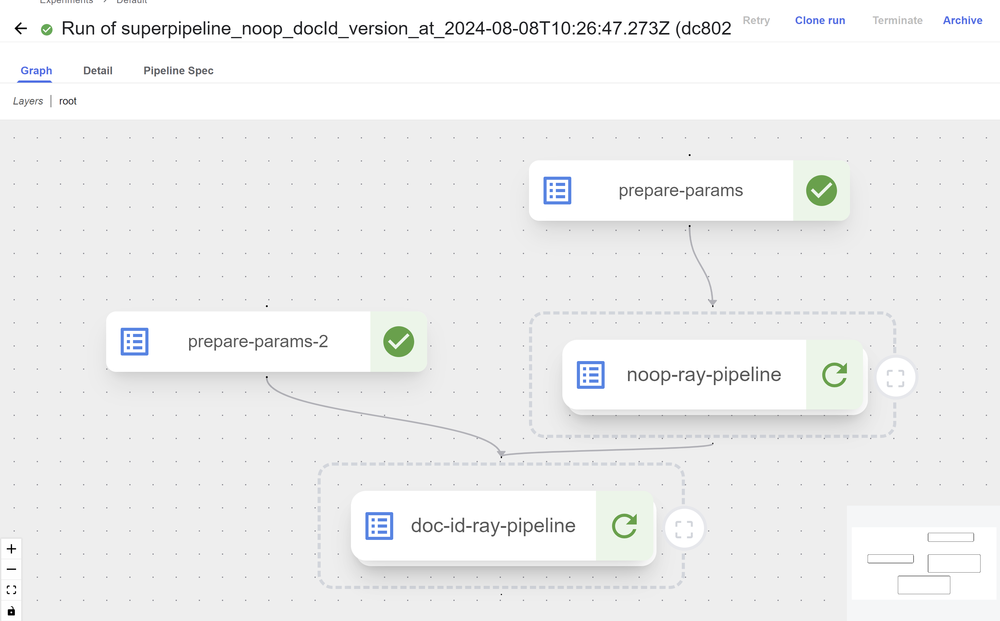
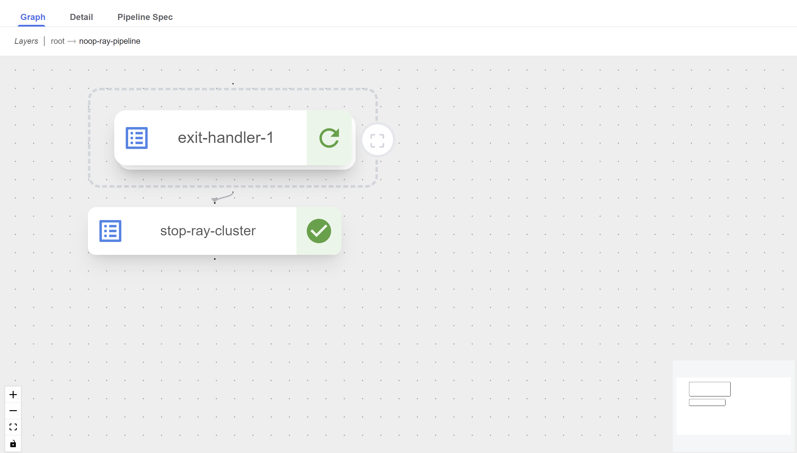
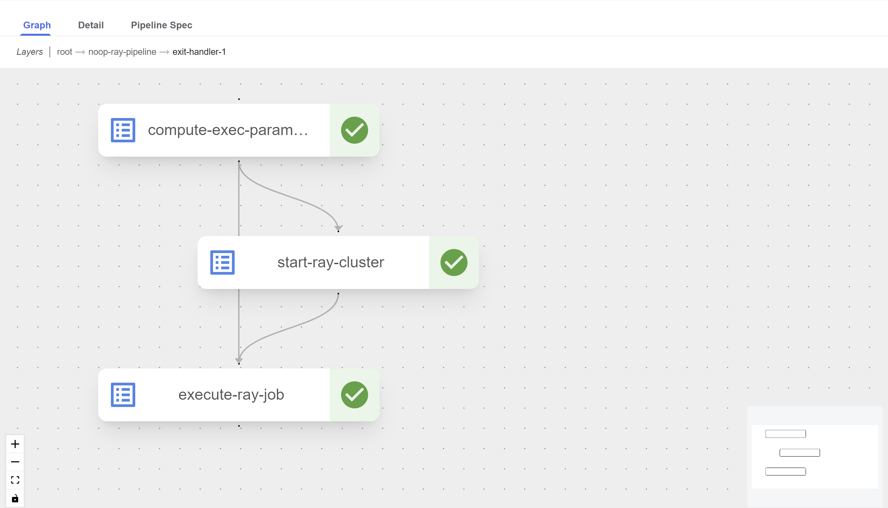
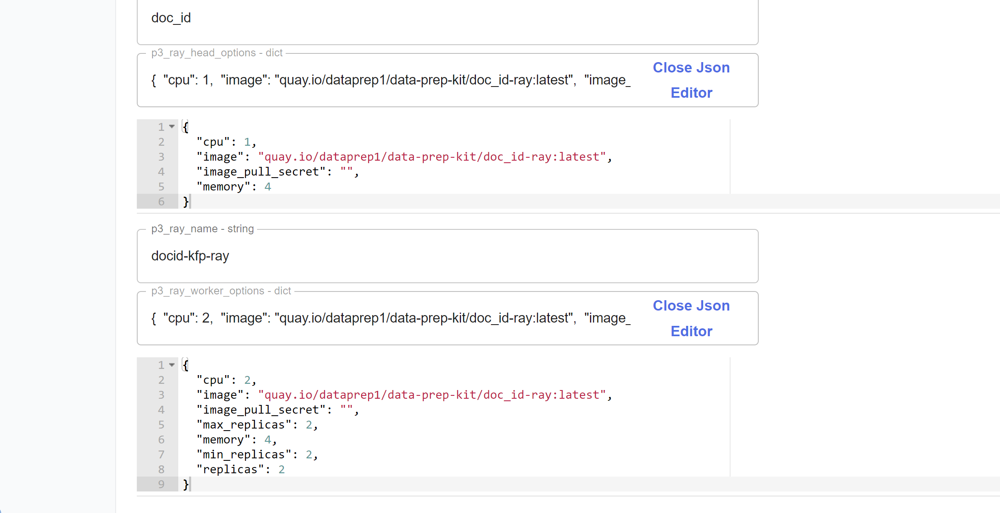

# Chaining transforms using KFP V2

As in [super pipelines of KFP v1](../../../doc/multi_transform_pipeline.md), we want to offer an option of running a series of transforms one after the other on the data. But, in KFP v2 we can make it easier to chain transforms using the [nested pipelines](https://www.kubeflow.org/docs/components/pipelines/user-guides/components/compose-components-into-pipelines/#pipelines-as-components) that KFP v2 offers.

One example of chaining `noop` and `document id` transforms can be found [here](superpipeline_noop_docId_v2.py). When running this pipeline it appears as hierarchical graph with two nested pipelines, one for each transform as shown in the following screenshots.

`root` Layer


`root -> noop-ray-pipeline` Layer


`root -> noop-ray-pipeline -> exit-handler-1` Layer


Another useful feature of the KFP v2 is the `Json` editor for the `dict` type input parameter as shown here:


## Main differences from KFP v1 superpipeline:
- It is not required to upload the transforms pipelines before running the superpipeline. So, when compiling the superpipeline code it gets the up to date versions of the transforms.
- It creates just one run that includes all the nested transfroms and their sub-tasks.
- No need for additional component as `executeSubWorkflowComponent.yaml`. All the implementation in the same pipeline file.
- In superpipelines of KFP v1 there exists an option to override the common parameters with specific values for each one of the transforms. This option is missing in the KFP v2 superpipelines.

### How to compile the superpipeline
```
cd kfp/superworkflows/ray/kfp_v2/
make clean
export KFPv2=1
export PYTHONPATH=../../../../transforms
make workflow-build
```
