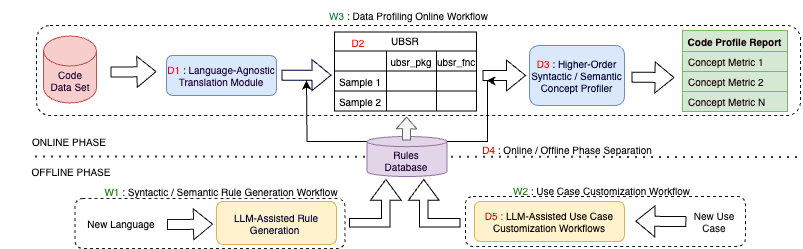

# Code Profiler Transform

This module extracts the base syntactic concepts from the multi-language source codes and represent these concepts in a unified langauge-agnostic representation that can be further used for multi-language data profiling. While programming languages expose similar syntactic building blocks to represent programming intent, such as importing packages/libraries, functions, classes, loops, conditionals, comments and others, these concepts are expressed through language-specific grammar, defined by distinct keywords and syntactic form. Our framework abstracts language-specific concepts by transforming them into a unified, language-agnostic representation called universal base syntactic representation (UBSR), referred to as a concept, which is consistently encoded within the proposed schema structure. The current version supports the base syntactic concept for importing/including package/libraries, comments, functions. 

Table 1 outlines the fields of the UBSR, which maps AST nodes to a structured schema. This schema captures syntactic nodes (based on AST node types) and the relationships between those nodes (derived from AST edges). The UBSR framework currently supports 21 languages, grouped according to their syntactic paradigms.

**Table 1: UBSR Schema Representation**

| **Key**               | **Possible Values**                                | **Description**                                                |
|-----------------------|----------------------------------------------------|----------------------------------------------------------------|
| **"nodes":**          |                                                    |                                                                |
| `"id"`                | Integer (e.g., `0`, `1`)                           | Unique identifier of the node.                                 |
| `"code_snippet"`      | String (e.g., `"ubsr_package math"`)               | A snippet of code or a description of the node.                |
| `"node_type"`         | String (e.g., `"ubsr_root"`, `"ubsr_package"`, etc.)| Type of node representing various syntactic concepts.          |
| `"parents"`           | Array of Integers (e.g., `[1, 2]`)                 | List of parent node IDs.                                       |
| `"children"`          | Array of Integers (e.g., `[1, 2]`)                 | List of child node IDs.                                        |
| **"metadata" (within nodes):** |                                            |                                                                |
| `"info"`              | String                                             | General information about the node.                            |
| `"language"`          | String (`"cpp"`, `"python"`, etc.)                 | Programming language of the node.                              |
| `"original_code"`     | String (e.g., `"int main() {...}"`)                | Original code snippet corresponding to the node.               |
| `"loc_original_code"` | Integer                                            | Line of code of the concept.                                   |
| **"edges":**          |                                                    |                                                                |
| `"directed_relation"` | String (`"parent_node"`)                           | Type of relationship between nodes e.g. parent-child.          |
| `"metadata"`          | Object                                             | Additional metadata for the edge, which can be empty.          |

As shown in Table 2, the framework standardizes code representation by categorizing languages within these paradigms for 21 languages. In cases where certain concepts are absent in a language, they are marked as NA in the table. The base syntactic concepts extracted from the UBSR derived from code can be used to derive syntactic and semantic insights of the code data.

**Table 2: Base Syntactic Concepts Supported by the UBSR across Different Syntactical Paradigms**

| **Syntactical Paradigms**                          | **Languages Supported (Known\*)**                                                                 | **Package** | **Function** | **Comment** |
|----------------------------------------------------|---------------------------------------------------------------------------------------------------|-------------|--------------|-------------|
| **C-like Syntax**                                  | **C\***, **Java\***, **C#**, **CPP**, **Objective C**, **Rust**, **Golang**, Kotlin                 | Yes         | Yes          | Yes         |
| **Scripting and Dynamic Syntax**                   | **Python\***, **JavaScript\***, **Dart**, **Typescript**                                           | Yes         | Yes          | Yes         |
|                                                    | QML                                                                                               | Yes         | NA           | Yes         |
|                                                    | **Perl**                                                                                          | Yes         | Yes          | NA          |
| **Functional and Expression-Oriented Syntax**      | **Haskell\***, Elm\*, Agda, **D**, **Nim**, **Scala**                                              | Yes         | Yes          | Yes         |
|                                                    | **Ocaml**                                                                                         | Yes         | NA           | Yes         |

* [python](python/README.md) - provides the base python-based syntactic concept extractor
implementation.
* [ray](ray/README.md) - provides the base ray-based syntactic concept extractor
implementation.

**Offline Path for Syntactic Rule Generation**

The offline path is critical for expanding and refining the syntactic rule database, enabling the UBSR framework to adapt to new languages and syntactic constructs. This process leverages LLMs to generate syntactic rules for languages that are not yet included in the rule database. To achieve this, we utilize a Few-shot Chain of Thought prompting technique, guiding the LLM through a step-by-step rule generation process. By providing carefully curated training exemplars and detailed instructions, this method ensures the LLM can accurately generalize from these examples to produce effective syntactic rules for a wide range of languages. This structured approach enhances the flexibility of the UBSR framework, allowing it to seamlessly handle evolving language constructs.

The implementation for UI-based offline customization tool is present [here](python/src/offline-customizations). To run the tool, use the following command.

`streamlit run LLM_runner_app.py`

The high-level system design is as follows:

For each new target language, the offline phase is utilized to create deterministic rules by harnessing the capabilities of LLMs and working with exemplar code samples from the target language. In this process, Workflow W1 facilitates the creation of rules around syntactic structures based on exemplar code samples, while Workflow W2 is used to establish semantic dimensions for profiling. Subsequently, we derive rules that connect syntactic constructs to the predefined semantic concepts. These rules are then stored in a rule database, ready to be employed during the online phase.

In the online phase, the system dynamically generates profiling outputs for any incoming code snippets. This is achieved by extracting concepts from the snippets using the rules in the database and storing these extractions in a tabular format. The structured tabular format allows for generating additional concept columns, which are then utilized to create comprehensive profiling reports.
