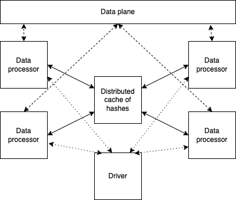

# Exect Deduplification Transform 

## Summary

Exact data deduplication is used to identify (and remove) records determined by native documents.
* It’s O(N2) complexity
* shuffling with lots of data movement

It can be implemented using 2 approaches:
* Exact string matching
* Hash-based matching (ASSUMPTION: a hash is unique to each native document.) – moving hash value is cheaper than moving full content

Implementation here is using “streaming” deduplication, based on central hash:

* At the heart of the implementation is a hash cache implemented as a set of Ray actors and containing
  unique hashes seen so far.
* Individual data processors are responsible for:
  * Reading data from data plane
  * Converting documents into hashes
  * Coordinating with distributed hashes cache to remove the duplicates
  * Storing unique documents back to the data plane

The complication of mapping this model to transform model is the fact that implementation requires a hash cache,
that transform mode knows nothing about. The solution here is to use transform runtime to create haches cache.
and pass it as a parameter to transforms.

## Transform runtime

Transform runtime is responsible for creation of the hashes cache. Additionally it 
enhances statistics information with the information about hashes cache size and utilization

## Configuration and command line Options

The set of dictionary keys holding [EdedupTransform](src/ededup_transform_ray.py)
configuration for values (common for Python and Ray) are as follows:

* _doc_column_ - specifies name of the column containing documents
* _doc_id_column_ - specifies the name of the column containing a document id
* _use_snapshot_ - specifies that ededup execution starts from a set of already seen hashes. This can be used
  for the incremental ededup execution
* _snapshot_directory_ - specifies a directory from which snapshots are read. If this is not specified, a default
  location (output_folder/snapshot is used)

## Snapshotting

In the current implementation we also provide snapshotting. At the end of execution, the content
of the hash cache to storage (local disk or S3). The reason this is done is to enable incremental
execution of dedup. You can run dedup on a set of existing files and snapshot the hash cache. Now
when additional files come in, instead of running dedup on all the files, you can load snapshot
from the previous run and run dedup only on new files

## Available runtimes

As per [transform project conventions](../../README.md#transform-project-conventions)
the following runtimes are available:

* [python](python/README.md) - enables running of the base python transformation
  in a Python runtime
* [ray](ray/README.md) - enables running of the base python transformation
in a Ray runtime
* [kfp](kfp_ray/README.md) - enables running the ray docker image 
in a kubernetes cluster using a generated `yaml` file.
