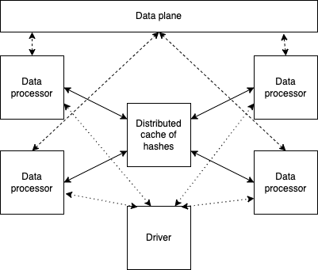

# Exact Dedup

Please see the set of
[transform project conventions](../../README.md)
for details on general project conventions, transform configuration,
testing and IDE set up.

## Summary

Exact data deduplication is used to identify (and remove) records determined by native documents.
* It’s O(N2) complexity
* shuffling with lots of data movement

It can be implemented using 2 approaches: 
* Exact string matching
* Hash-based matching (ASSUMPTION: a hash is unique to each native document.) – moving hash value is cheaper than moving full content

Implementation here is using “streaming” deduplication, based on central hash:



* At the heart of the implementation is a hash cache implemented as a set of Ray actors and containing 
unique hashes seen so far.
* Individual data processors are responsible for:
  * Reading data from data plane
  * Converting documents into hashes
  * Coordinating with distributed hashes cache to remove the duplicates
  * Storing unique documents back to the data plane

The complication of mapping this model to transform model is the fact that implementation requires a hash cache, 
that transform mode knows nothing about. The solution here is to use transform runtime to create haches cache.
and pass it as a parameter to transforms.

## Transform runtime

[Transform runtime](src/ededup_transform.py) is responsible for creation hash actors and sending their 
handles to the transforms themselves
Additionally it enhances statistics information with the information about hashes cache size and utilization

## Building

A [docker file](Dockerfile) that can be used for building docker image. You can use

```shell
make build to build it
```

## Configuration and command line Options

The set of dictionary keys holding [EdedupTransform](src/ededup_transform.py)
configuration for values are as follows:

* _hash_cpu_ - specifies an amount of CPUs per hash actor
* _num_hashes_ - specifies number of hash actors
* _doc_column_ - specifies name of the column containing documents

We also provide an [estimate](src/cluster_estimator.py) to roughly determine cluster size for running transformer.

## Running

We also provide several demos of the transform usage for different data storage options, including
[local file system](src/ededup_local_ray.py) and [s3](src/ededup_s3.py)

```shell
$ source venv/bin/activate
(venv) $ export PYTHONPATH=src
(venv) $ python src/ededup_local_ray.py
14:56:26 INFO - Running locally
14:56:26 INFO - exact dedup params are {'doc_column': 'contents', 'hash_cpu': 0.5, 'num_hashes': 2}
14:56:26 INFO - data factory data_ is using local data accessinput_folder - /Users/boris/Projects/fm-data-engineering/transforms/universal/ededup/test-data/input output_folder - /Users/boris/Projects/fm-data-engineering/transforms/universal/ededup/output
14:56:26 INFO - data factory data_ max_files -1, n_sample -1
14:56:26 INFO - data factory data_ Not using data sets, checkpointing False, max files -1, random samples -1, files to use ['.parquet']
14:56:26 INFO - number of workers 3 worker options {'num_cpus': 0.8}
14:56:26 INFO - pipeline id pipeline_id; number workers 3
14:56:26 INFO - job details {'job category': 'preprocessing', 'job name': 'ededup', 'job type': 'ray', 'job id': 'job_id'}
14:56:26 INFO - code location {'github': 'github', 'commit_hash': '12345', 'path': 'path'}
14:56:26 INFO - actor creation delay 0
2024-04-18 14:56:29,660	INFO worker.py:1715 -- Started a local Ray instance. View the dashboard at 127.0.0.1:8265 
(orchestrate pid=8997) 14:56:32 INFO - orchestrator started at 2024-04-18 14:56:32
(orchestrate pid=8997) 14:56:32 INFO - Number of files is 1, source profile {'max_file_size': 0.034458160400390625, 'min_file_size': 0.034458160400390625, 'total_file_size': 0.034458160400390625}
(orchestrate pid=8997) 14:56:32 INFO - Cluster resources: {'cpus': 16, 'gpus': 0, 'memory': 11.665910720825195, 'object_store': 2.0}
(orchestrate pid=8997) 14:56:32 INFO - Number of workers - 3 with {'num_cpus': 0.8} each
(orchestrate pid=8997) 14:56:32 INFO - Completed 0 files in 8.14994176228841e-06 min. Waiting for completion
(orchestrate pid=8997) 14:56:34 INFO - Completed processing in 0.03894638220469157 min
(orchestrate pid=8997) 14:56:34 INFO - done flushing in 0.0025119781494140625 sec
14:56:44 INFO - Completed execution in 0.3081724007924398 min, execution result 0
```

### Launched Command Line Options
When running the transform with the Ray launcher (i.e. TransformLauncher),
the following command line arguments are available in addition to
[the options provided by the launcher](../../../data-processing-lib/doc/launcher-options.md).

```shell
--hash_cpu HASH_CPU   number of CPUs per hash
 --num_hashes NUM_HASHES
                        number of hash actors to use
 --doc_column DOC_COLUMN
                        key for accessing data
```

These correspond to the configuration keys described above.


