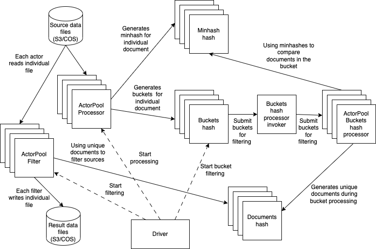

# Fuzzy Dedup

Please see the set of
[transform project conventions](../../../README.md)
for details on general project conventions, transform configuration,
testing and IDE set up.

## Summary

The basic implementation of the fuzzy dedup is based on [MinHash](https://en.wikipedia.org/wiki/MinHash). Also see
[here](http://infolab.stanford.edu/~ullman/mmds/ch3n.pdf) for more details. The architecture of the implementation is presented here:



The main components of implementation are driver, processors (implemented as actor pools) - table processor, table 
filter and bucket hash processor, and hash actors - minhash, buckets and docs. 

The complication of mapping this model to transform model is the fact that in this model assumes a two pass processing, 
while a transform model is a single pass. The solution to this mismatch is to use transform runtime to implement the 
first path and use the native transform pipeline to implement filtering.

## Transform runtime
The [transform runtime](src/fdedup_transform_ray.py) is implementing complete first path of the fuzzy deduping:
* creates bucket and minhash collectors
* implements initial file processing to populate bucket and minhash caches
* creates doc collectors 
* implement bucket processing
* Clean up everything except for doc collectors in preparation to filter, that is implemented by the framework proper
The main components of runtime are described below

### TableProcessor Actor

[Table processing actor](src/fdedup_transform_ray.py) is implemented following framework itself is implemented as a pair -
`FdedupTransform` implementing the actual transformation and and 
[transform table processor](../../../../data-processing-lib/src/data_processing/runtime/ray/transform_table_processor.py) 
(from the framework itself).

### DocsMinHash Actor

This [actor](src/fdedup_support.py) stores MInHashes

### BucketsHash Actor

This actor [actor](src/fdedup_support.py)

### BucketHashProcessor

BucketHash [actor](src/fdedup_support.py) implement the actual buckets processing, removing duplicates. 
Implementation of this actor allows to better manage this "expensive" process, by using Actor pool load balancing
thus minimizing overall time for this operation. Instead of pre partitioning buckets, it is using dynamic load
partitioning. We also are processing "longest" buckets first thus further improving performance. To further improve
the overall performance we can in future implement bucket splitting - its faster to process more smaller buckets 
then the long ones

### BucketHashProcessor

This [actor](src/fdedup_support.py) is queueing up requests to the `BucketHashProcessor` actor pool, which load 
balances their execution

### DocCollector Actor

This [actor](src/fdedup_support.py) is a collector for unique documents

## Transformer

In the fuzzy dedup implementation, the [transformer](src/fdedup_transform_ray.py) only implements filtering. For every
table, it checks document ids with the `DocumentsCollector` cache and removes all of the rows which do not have ids in 
the hash 

## Snapshotting

Fuzzy dedup often runs on very large data sets and implements three very distinct phases:
* Building buckets
* Processing buckets
* Filtering data
To improve recoverability of fuzzy dedup, current implementation includes snapshotting - at the end of the first two 
phases we snapshot the current state of execution - bucket and minhash actors after the first phase and document actors 
after the second. This snapshotting provide code with the ability to restart from the existing snapshot. You can use one
of two configuration flags (assuming snapshots exist):
* `use_bucket_snapshot` to start from the second phase
* `use_doc_snapshot` to start from the third phase

## Building

A [docker file](Dockerfile) that can be used for building docker image. You can use 

```shell
make build to build it
```

### Configuration and command line Options

The set of dictionary keys holding [BlockListTransform](src/blocklist_transform.py)
configuration for values are as follows:

* _bucket_cpu_ - specifies number of CPUs for bucket actor
* _doc_cpu_ - specifies number of CPUs for doc actor
* _mhash_cpu_ - specifies number of CPUs for minhash actor
* _num_doc_actors_ - specifies number of doc actors
* _num_bucket_actors_ - specifies number of bucket actors
* _num_minhash_actors_ - specifies number of minhash actors
* _num_preprocessors_ - specifies number of preprocessors
* _num_permutations_ - specifies number of permutations
* _threshold_ - specifies threshold
* _shingles_size_ - specifies shingles size
* _japanese_data_ - specifies whether to use japanese specific document splitting
* _delimiters_ - specifies delimiter for non japanese document splitting
* _snapshot_delay_ - delay between different actors reading/writing snapshot not to overwhelm storage
* -use_bucket_snapshot_ - run from the existing buckets snapshot (bypass building buckets)
* -use_doc_snapshot_ - run from the existing docs snapshot (bypass building and processing buckets)

Above you see both parameters and their values for small runs (tens of files). We also provide an 
[estimate](src/cluster_estimator.py) to roughly determine cluster size for running transformer.

## Running


### Launched Command Line Options
When running the transform with the Ray launcher (i.e. TransformLauncher),
the following command line arguments are available in addition to
[the options provided by the launcher](../../../../data-processing-lib/doc/ray-launcher-options.md).

```shell
  --fdedup_doc_column FDEDUP_DOC_COLUMN
                        document column name
  --fdedup_id_column FDEDUP_ID_COLUMN
                        integer document id column name
  --fdedup_cluster_column FDEDUP_CLUSTER_COLUMN
                        cluster column name
  --fdedup_bucket_cpu FDEDUP_BUCKET_CPU
                        number of CPUs per bucket hash
  --fdedup_mhash_cpu FDEDUP_MHASH_CPU
                        number of CPUs per minhash hash
  --fdedup_doc_cpu FDEDUP_DOC_CPU
                        number of CPUs per doc hash
  --fdedup_num_doc_actors FDEDUP_NUM_DOC_ACTORS
                        number of doc actors to use
  --fdedup_num_minhash_actors FDEDUP_NUM_MINHASH_ACTORS
                        number of minhash actors to use
  --fdedup_num_bucket_actors FDEDUP_NUM_BUCKET_ACTORS
                        number of bucket actors to use
  --fdedup_num_preprocessors FDEDUP_NUM_PREPROCESSORS
                        number of preprocessors to use
  --fdedup_num_permutations FDEDUP_NUM_PERMUTATIONS
                        number of permutations
  --fdedup_threshold FDEDUP_THRESHOLD
                        threshold
  --fdedup_shingles_size FDEDUP_SHINGLES_SIZE
                        number of words in shingle
  --fdedup_delimiters FDEDUP_DELIMITERS
                        delimiter for splitting document
  --fdedup_snapshot_delay FDEDUP_SNAPSHOT_DELAY
                        snapshot delay time
  --fdedup_use_bucket_snapshot FDEDUP_USE_BUCKET_SNAPSHOT
                        flag to continue with bucket snapshot
  --fdedup_use_doc_snapshot FDEDUP_USE_DOC_SNAPSHOT
                        flag to continue with doc snapshot
  --fdedup_random_delay_limit FDEDUP_RANDOM_DELAY_LIMIT
                        maximum delay between read
```

These correspond to the configuration keys described above.

### Running the samples
To run the samples, use the following `make` targets

* `run-cli-sample` - runs src/fdedup_transform_ray.py using command line args
* `run-local-sample` - runs src/fdedup_local_ray.py
* `run-s3-sample` - runs src/fdedup_s3_ray.py
    * Requires prior installation of minio, depending on your platform (e.g., from [here](https://min.io/docs/minio/macos/index.html)
     and [here](https://min.io/docs/minio/linux/index.html) 
     and invocation of `make minio-start` to load data into local minio for S3 access.

These targets will activate the virtual environment and set up any configuration needed.
Use the `-n` option of `make` to see the detail of what is done to run the sample.

For example, 
```shell
make run-cli-sample
...
```
Then 
```shell
ls output
```
To see results of the transform.
